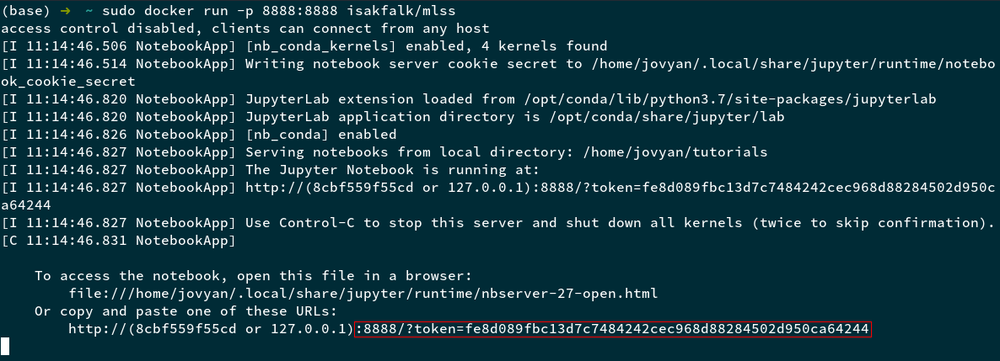

# Table of Contents

1.  [README](#org2bb2b7c)
    1.  [How to read this README](#orgae61f65)
    2.  [Docker](#Docker-heading)
        1.  [Install Docker](#orgba82d9a)
        2.  [Pull MLSS docker image](#org166488a)
        3.  [Run docker image with Jupyter](#Docker-jupyter-heading)
    3.  [Conda](#Conda-heading)
    4.  [Tutorials](#org914e8b6)
        1.  [Deep Learning](#org62de496)
        2.  [Optimization](#orgf3b81a4)
        3.  [Variational Inference](#orga41ae0b)
        4.  [Reinforcement Learning](#org1073393)
        5.  [Gaussian Processes](#orgce7e441)
        6.  [Kernels](#org8c25732)
        7.  [Markov Chain Monte Carlo](#org43f6d5c)
        8.  [Approximate Bayesian Computation](#org379f195)
        9.  [Speech Processing](#org5f689cc)
        10. [ML in Computational Biology](#org639b6b3)

# README

MLSS 2019 will have interactive and practical tutorials in the following subjects

-   Deep Learning
-   Optimization
-   Variational Inference
-   Reinforcement Learning
-   Gaussian Processes
-   Kernels
-   Markov Chain Monte Carlo
-   Approximate Bayesian Computation
-   Speech Processing
-   ML in Computational Biology

Since many of these tutorials require the participants to install software with
sometimes complex dependencies which means the installation process will differ
between platforms (e.g Linux, OSX and Windows) and to make sure the tutorials
run smoothly, we have prepared ways for everyone to come prepared and reduce
technical issues to minimum. 

This means we will get more time for the actual content!

## How to read this README

Since the tutorials differ in terms of programming languages used and how the
tutorials will be run, each tutorial will get its own section where instructions
on how to get started and get the environment for this tutorial up and running.

Most of the tutorials will be run from a [docker image](https://docker-curriculum.com/#docker-images) that we have created. If
you want to read more about docker this can be done [here](https://docker-curriculum.com/#docker-images).

## Docker

We have created a docker image that runs a jupyter notebook with kernels for the
tutorials which you will be access through `localhost:8888` in your browser
after you follow the guide below.

### Install Docker

Follow these instruction to install docker. If you follow the guide, everything
should be fine. If you still have problem, please ask in the Slack general
channel or ping me (@Isak Falk) anywhere on the MLSS2019 Slack :)

1.  Install docker on your platform (Community Edition (CE), not Enterprise
    Edition (EE))
    -   Linux
        -   [Ubuntu](https://www.digitalocean.com/community/tutorials/how-to-install-and-use-docker-on-ubuntu-18-04)
        -   [Linux (general)](https://docs.docker.com/v17.12/install/#server)
    -   [OSX / Mac](https://docs.docker.com/v17.12/docker-for-mac/install/#what-to-know-before-you-install)
    -   [Windows](https://docs.docker.com/v17.12/docker-for-windows/install/)
2.  Make sure Docker works
    -   **Command line / terminal:** In a terminal run `docker run hello-world`, this will give an
        output similar to this
    -   **Application:** Make sure the Docker application is installed and that you
        can find the icon when you search for it (this will depend
        on your system)

### Pull MLSS docker image

Pull the MLSS docker image to your computer, this image is located [here](https://cloud.docker.com/u/isakfalk/repository/docker/isakfalk/mlss).

Run the following in a terminal

    docker pull isakfalk/mlss:latest

This will make the image available to you on your system. The image is a bit
large (3gb compressed, 7gb uncompressed), this is normal, don't worry about it.

### Run docker image with Jupyter

In order to get jupyter working, do the following from a terminal (note: this is
how I do it on Linux, let me know if we need to do it another way on another platform)

1.  Run `sudo docker run -p 8888:8888 isakfalk/mlss`, this will start the image
    we pulled (`isakfalk/mlss`) and forward the port 8888 us on port 8888.
2.  You should see the following in your terminal
    
    Copy the outlined part (you can do this using the command `ctrl-shift-c` in a
    terminal on Linux at least)
3.  In your browser of choice, do the following: paste the copied part into the
    browser and prefix it with `localhost`, like the image below
    
4.  Congratulations! It should be working now. You can change the kernel to the tutorial
    kernel by clicking on the notebook you want to run and then go to the
    tab **Kernel** and choose **Change kernel**, you will be presented with the
    available kernels.

## Conda

Some tutorials do not use jupyter notebooks. In this case, make sure you have
[anaconda](https://docs.anaconda.com/anaconda/install/) installed on your machine. Then run the following in a terminal where
`$TUTORIALS_DIR` is the path to the git directory of the mlss2019 tutorials that you can
clone from [here](https://github.com/mlss-2019/tutorials) and `$ENV_NAME.yml` is the name of the environment yaml file:

    cd $TUTORIALS_DIR/environments/
    conda env create -f $ENV_NAME.yml
    conda activate $ENV_NAME

You should now be in the conda environment and can run the necessay files (e.g.
`python tutorial.py`) successfully.

Alternatively, this could be done from the anaconda application directly.

## Tutorials

### Deep Learning

TODO

### Optimization

TODO

### Variational Inference

Best to run this in colab as you will get access to GPU. Upload the jupyter notebook
`$TUTORIALS_DIR/VAE/MLSS2019_VAEs_exercise.ipynb` to [Google Colab](https://colab.research.google.com/) and run it
there.

If you want / need to run it locally, see [Docker](#Docker-heading), or go directly to [how to run
jupyter with docker](#Docker-jupyter-heading) if you have already installed and pulled the docker image.

### Reinforcement Learning

See [Docker](#Docker-heading), or go directly to [how to run jupyter with docker](#Docker-jupyter-heading) if you have already
installed and pulled the docker image.

### Gaussian Processes

See [Docker](#Docker-heading), or go directly to [how to run jupyter with docker](#Docker-jupyter-heading) if you have already
installed and pulled the docker image.

1.  `Lab1 - Sampling a GP.ipynb`

    If you find that the first cell
    
        import numpy as np
        import matplotlib
        matplotlib.rcParams['figure.figsize'] = (14, 6)
        plt = matplotlib.pyplot
    
    doesn't work, change this cell to
    
        import numpy as np
        import matplotlib
        matplotlib.rcParams['figure.figsize'] = (14, 6)
        import matplotlib.pyplot as plt

2.  `Lab2 - GPflow and GP Regression.ipynb`

    See [Lab1](#GP-lab1-heading)

### Kernels

TODO

### Markov Chain Monte Carlo

See [Conda](#Conda-heading) with `$ENV_NAME.yml` set to `mlss_mcmc.yml`. After activating the
environment, go to `$TUTORIALS_DIR/betancourt/` and then run each tutorial by
using

    python $TUTORIAL_NAME.py

### Approximate Bayesian Computation

TODO

### Speech Processing

TODO

### ML in Computational Biology

TODO

